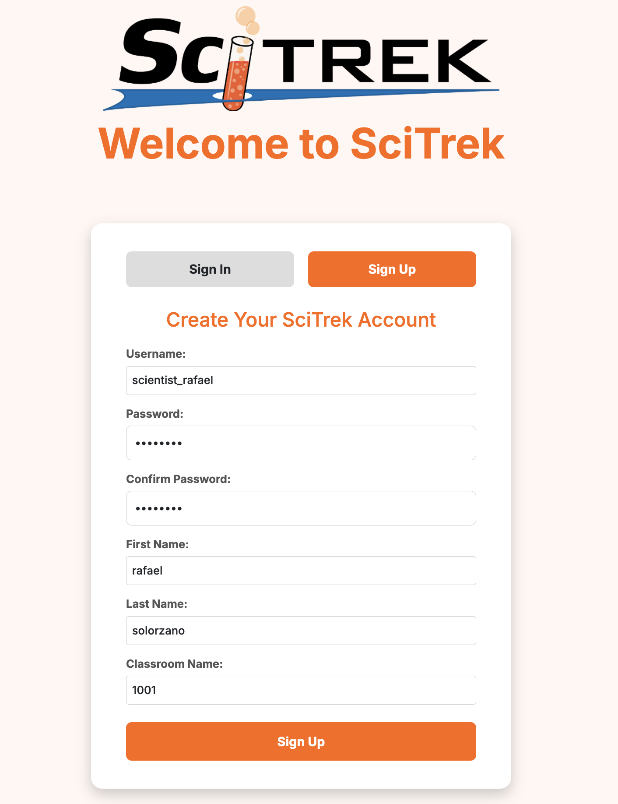
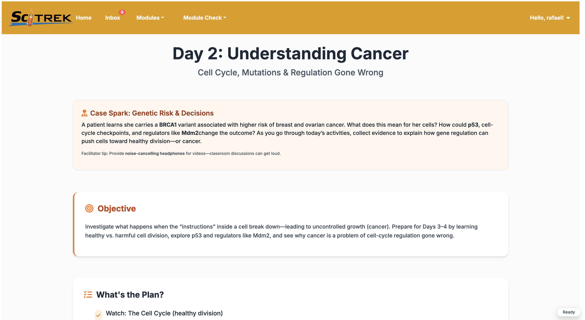

# 🌟 Sci-Trek Bioinformatics Website  

> **Empowering students to explore science through inquiry-based virtual research experiences.**  
> _Developed at UC Santa Barbara | SciTrek Program_

---

## SciTrek Bioinformatics Module

Welcome to the **Sci-Trek Bioinformatics** learning platform — an interactive website designed to bring real-world research into the classroom.  
Students step into the role of a scientist, guided through daily missions that connect **genomics**, **bioinformatics**, and **cancer biology** in an engaging, accessible way.

---

## 🧰 Tech Stack


---

## ⚙️ Setup

**Clone** (GitHub → Code → HTTPS, copy link):

```bash
git clone https://github.com/rafael-solorzano/scitrek-bioinformatics.git
cd scitrek-bioinformatics
```

**Backend** (Terminal A):

```bash
cd backend
python3 -m venv venv && source venv/bin/activate
cd scitrek_backend
pip install -r requirements.txt
mkdir -p .devdata
touch .devdata/db.sqlite3
python manage.py makemigrations && python manage.py migrate
python manage.py runserver
```

**Frontend** (new terminal):

```bash
cd scitrek-bioinformatics/frontend/scitrek-frontend
npm install && npm start
```

Backend: [http://localhost:8000](http://localhost:8000) · Frontend: [http://localhost:3000](http://localhost:3000)

---

## 🚀 Getting Started

Students can join their classroom using a **unique access code** provided by the teacher.  

For example, use code **1001** to enter the demo classroom.  

### 🔑 Login Page Example  
Here’s how a student signs up using their classroom code:

<p align="center">
  
</p>

---

## 🔬 Inside the Module

Each day unveils a new step in a student’s virtual research journey — from understanding genes and mutations to exploring cancer biology and interpreting gene expression data.

### 🌿 Day 3 Glimpse  
Here’s a snapshot of **Day 3**, where students compare healthy vs. cancer cells and analyze bioinformatics results:

<p align="center">
  
</p>

---

## 💡 About Sci-Trek

The **Sci-Trek Bioinformatics** platform is a first-of-its-kind interactive web module that combines:  

- 🧠 **Simplified real-world datasets**  
- 🧩 **Daily guided inquiry**  
- 🎓 **Virtual scientist storytelling**  

Teachers and mentors can launch entire lessons **instantly**, with **no setup, supplies, or specialized training required.**

---

## 🌍 Mission

Our goal is to make authentic research experiences **accessible to every student**, regardless of resources — inspiring the next generation of scientists to think critically, explore boldly, and engage with real data.

---
## 👩‍💻 Developed By

| Name                        | Role                                        | GitHub                                                   |
|-----------------------------|---------------------------------------------|----------------------------------------------------------|
| Rafael Solorzano            | Software Engineer & PhD Researcher          | [@rafael-solorzano](https://github.com/rafael-solorzano) |
| Siddhant (Andy) Subramanian | Software Engineer & Undegraduate Researcher | [@Siddhant-Subramanian](https://github.com/Anteater10)   |


---
© 2025 **SciTrek Research Group | UC Santa Barbara**  

---